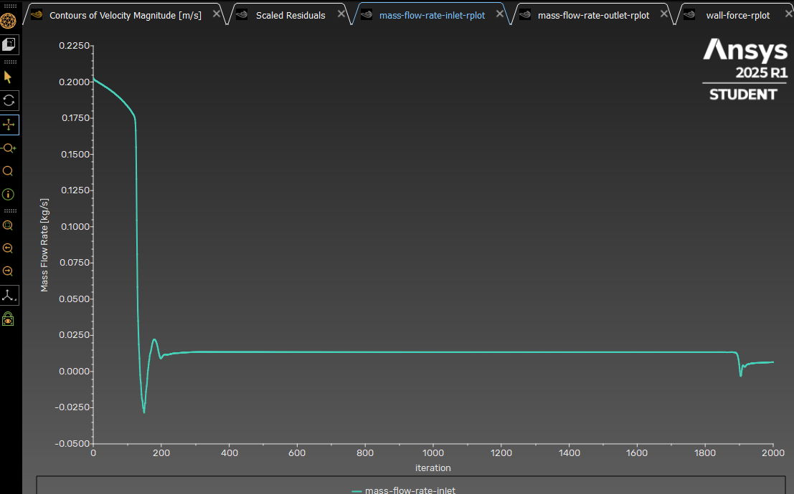
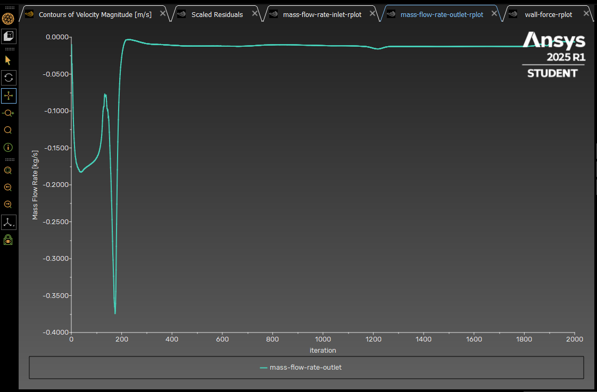
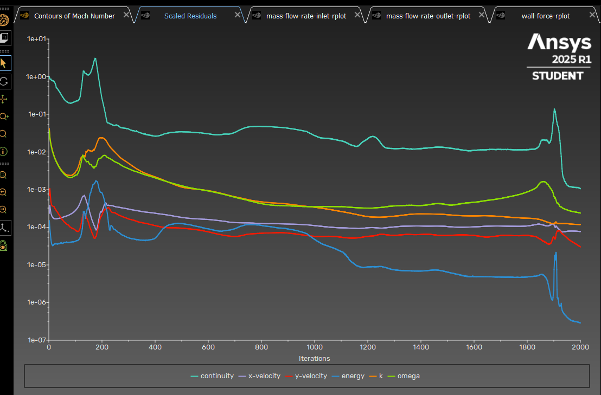
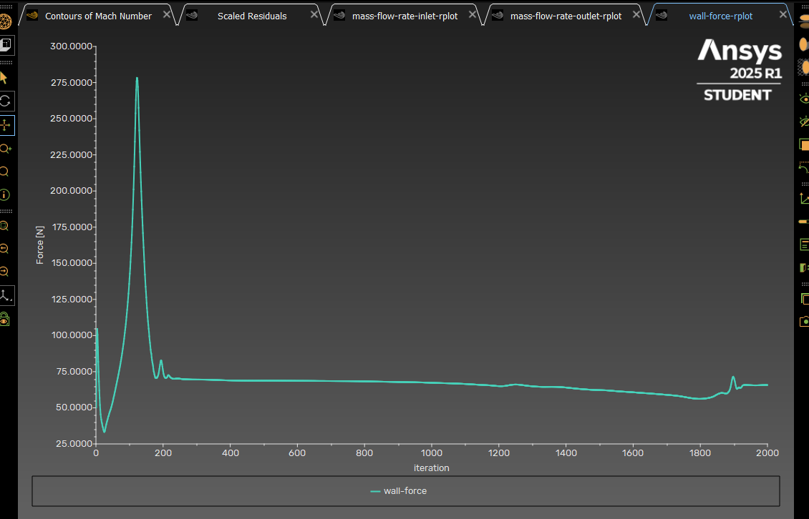
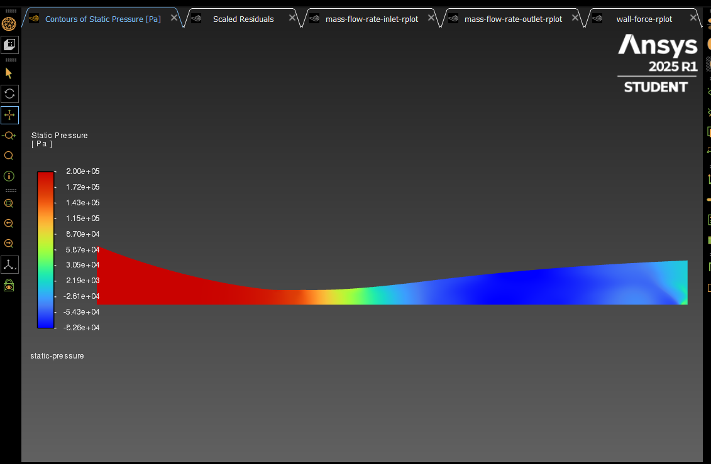
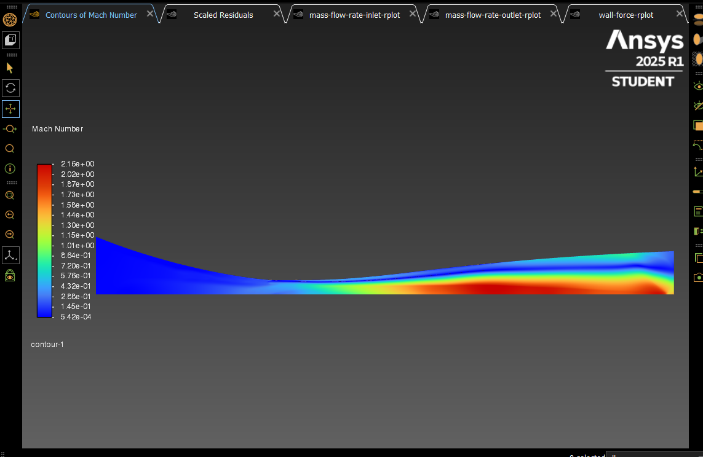
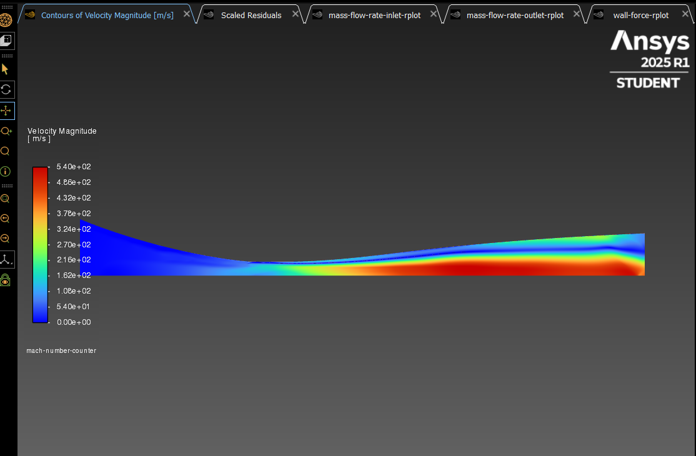
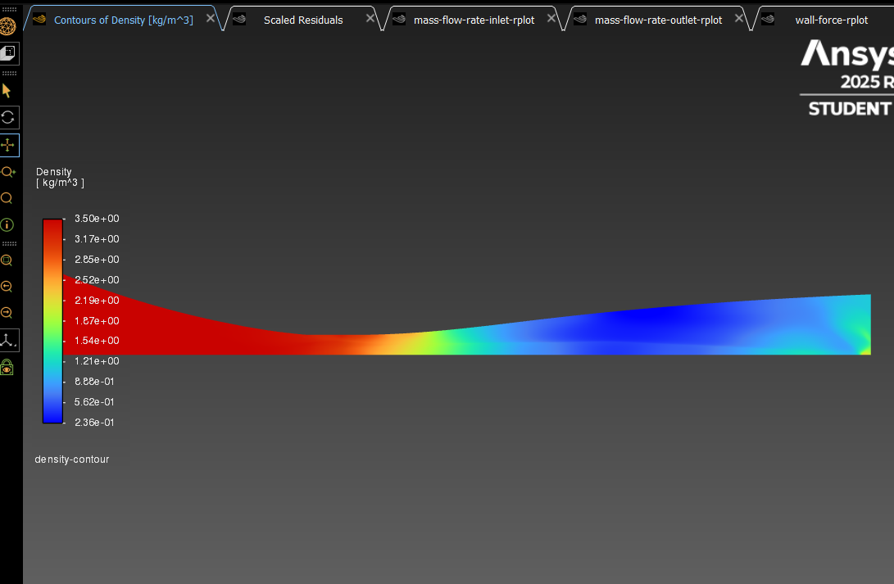

# 🚀 Axisymmetric CFD Simulation of a Bézier Nozzle

This project presents a 2D **axisymmetric CFD simulation** of a Bézier-profile nozzle, designed to compare its performance with a traditional Laval nozzle under nearly identical conditions.

---

## ✅ Simulation Overview

- **Geometry Type:** Axisymmetric (2D)
- **Inlet Diameter:** 10 mm  
- **Outlet Diameter:** 7.5 mm  
- **Fluid:** Air (Ideal Gas)  
- **Inlet Pressure:** 200,000 Pa  
- **Outlet Pressure:** 0 gauge pressure  
- **Solver:** Pressure-Based  
- **Turbulence Model:** SST k-ω  
- **Energy Equation:** Enabled  
- **Iterations:** 2000  
- **Mesh Elements:** ~460,000  

---

## 🔄 Mass Inlet and Outlet

---

## 🔄 Mass Flow Rate

| Location | Mass Flow Rate (kg/s) |
|----------|------------------------|
| Inlet    | 0.0133                 |
| Outlet   | 0.0125                 |

**Mass Flow Difference:** ≈ **6.02%**

---

## 🚀 Scaled Residuals

## 🧱 Wall Force

- **Result:** **270 N**

---

## 🌡️ Temperature Contour

---

## 📊 Pressure Contour

---

## 🌀 Mach Number Contour

---

## 💨 Velocity Magnitude Contour

---

## 🌫️ Density Contour

---

## 📘 Notes

- Both Bézier and Laval nozzle geometries were tested under equivalent boundary conditions and mesh densities (~450–500k cells) and same iterations.
- Goal: Understand the effect of nozzle geometry on **choked flow**, **shock patterns**, and **wall forces**.

---

## 📊 Results & Observations

- **Shock Behavior:**  
  In the Bézier nozzle, shock transitions appear more **diffused and less abrupt** compared to the De Laval nozzle. This is likely due to the **curved, smooth wall profile**, which allows pressure gradients to distribute more gradually.  
  In contrast, the Laval nozzle—with its sharper geometric transitions—produces **more distinct shock patterns** and flow separation zones.

- **Wall Force Comparison:**  
  Due to its geometry, the Bézier nozzle produced a **lower wall force (270 N)** than the Laval nozzle under the same inlet and outlet conditions. This can be attributed to **gentler flow acceleration and deceleration**, reducing the net force acting on the walls.

- **Mass Flow Balance:**  
  The Bézier nozzle exhibited a **smaller difference between inlet and outlet mass flow rates**, which indicates **a more stable and efficient flow pattern** in numerical terms.  
  This also implies that **convergence was smoother**, and numerical diffusion or recirculation effects were minimized.

> These results suggest that while the De Laval nozzle offers stronger thrust potential due to higher wall forces, the Bézier nozzle provides smoother flow characteristics with potentially lower noise, shock intensity, and computational cost.

---

## ✍️ Author

**Burak Yorukcu**  

